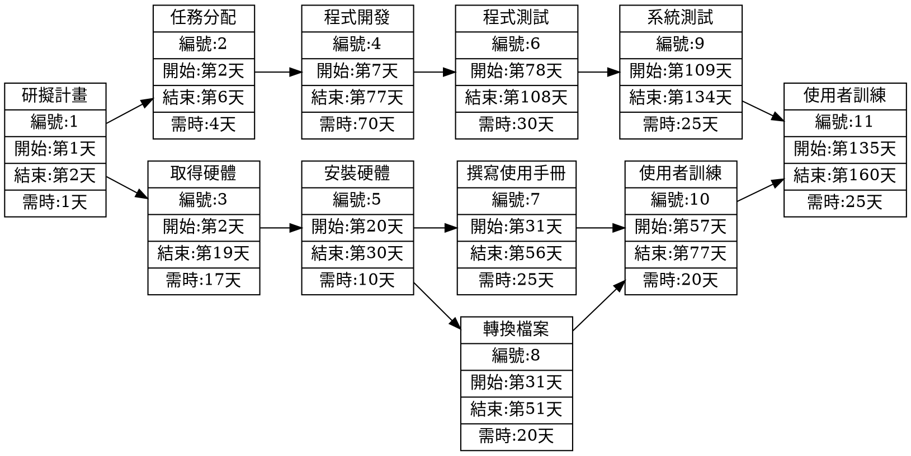

```graphviz
digraph {
	node[shape=record];
	rankdir="LR";
    no1 [label = "研擬計畫 | 編號:1 | 開始:第1天 | 結束:第2天 | 需時:1天"]
    no1->no2
    no1->no3
    no2 [label = "任務分配 | 編號:2 | 開始:第2天 | 結束:第6天 | 需時:4天"]
    no3 [label = "取得硬體 | 編號:3 | 開始:第2天 | 結束:第19天 | 需時:17天"]
    no2->no4
    no4 [label = "程式開發 | 編號:4 | 開始:第7天 | 結束:第77天 | 需時:70天"]
    no3->no5
    no5 [label = "安裝硬體 | 編號:5 | 開始:第20天 | 結束:第30天 | 需時:10天"]
    no4->no6
    no6 [label = "程式測試 | 編號:6 | 開始:第78天 | 結束:第108天 | 需時:30天"]
    no5->no7
    no7 [label = "撰寫使用手冊 | 編號:7 | 開始:第31天 | 結束:第56天 | 需時:25天"]
    no5->no8
    no8 [label = "轉換檔案 | 編號:8 | 開始:第31天 | 結束:第51天 | 需時:20天"]
    no6->no9
    no9 [label = "系統測試 | 編號:9 | 開始:第109天 | 結束:第134天 | 需時:25天"]
    no7->no10
    no8->no10
    no10 [label = "使用者訓練 | 編號:10 | 開始:第57天 | 結束:第77天 | 需時:20天"]
    no9->no11
    no10->no11
    no11 [label = "使用者訓練 | 編號:11 | 開始:第135天 | 結束:第160天 | 需時:25天"]
    
    }
```